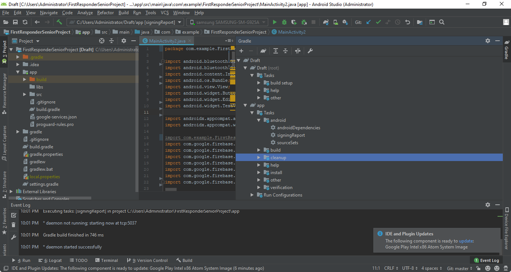
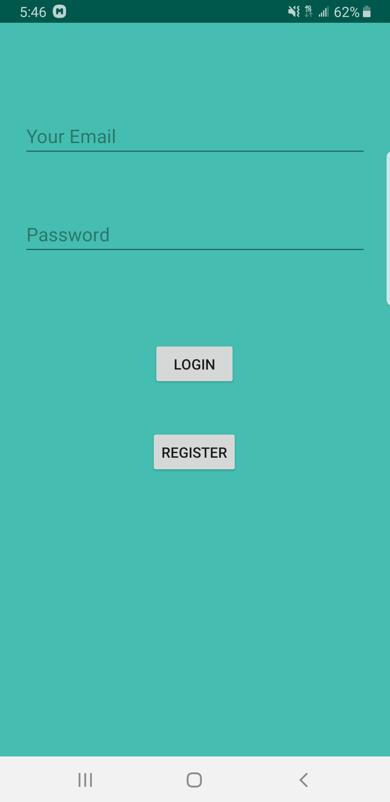

# First_Responder_Mobile_Application
Final SeniorProject
This is a README.txt file that will guide you in following and developing our prototype First Responder Smartwatch.
-----------------------------------------------------------------------------------------------------------------------------------

Hardware Components required:

1. A Heart Rate Sensor: Can be any type, in this project, the HR sensor is SPARKFUN Pulse Oximeter & HeartRate Sensor
2. Development board: DISCO-L475VG-IOT0A1, development board that has bluetooth integration into it.
3. A GPS Sensor or equivalent: In this project, the AT&T Second Generation IoT kit
-------------------------------------------------------------------------------------------------------------------------------------
Software Components required:

1. MBED STUDIO : One of the optional platforms that are able to load/download projects and develop your program.
2. MBED CLI    : A command prompt that enables the handling of projects similar to MBED STUDIO. Allows integration of plugins 				   that aren't allowed on Mbed Studio.
3. Android Studio: A free mobile development program that is able to interface with the development of the hardware via bluetooth.
4. Firebase:	 A easy to integrate database that works well with multiple platforms such as Android Studio
5. Google Cloud Platform: Creates the credentials keys to utilize some of the API such as Google Maps, may be necessary for any map activity. 
6. Optional (Arduino) : Mbed and arduino are compatibles through arduino uno. The sensor and code should work on both platforms.
-----------------------------------------------------------------------------------------------------------------------------------
The tutorial will be seperated into different sections according to the hardware components.

HEART RATE SENSOR:
In this case, the SparkFun provides some example code to use which can be altered to match the specific functionality required. In this case, the example code used is Example1_config_BPM_MODE.
Also on there website, the Library used is Sparkfun_bio_Sensor_Hub_library, both header and CPP file. 
Here are the links:
Sparkfun bio sensor:
	1. https://learn.sparkfun.com/tutorials/sparkfun-pulse-oximeter-and-heart-rate-monitor-hookup-guide/all#sparkfun-bio-sensor-arduino-library
or through their github:
	2.https://github.com/sparkfun/SparkFun_Bio_Sensor_Hub_Library

The github for the Arduino/Mbed(MBED Library still in progress of creation) code for the SparkFun will be listed soon!
Android Studio:
Create a new project with a basic activity that would act as your main page. Once in, create a new activity, or individual an resource/java class. Make another project with the sample example called BLUETOOTHLEGATT. This is the premise for our bluetooth connection that requires some modification to work. 
-------------------------------------------------------------------------------------------------------
GPS(AT&T Github):
This will be posted here on my partner's github:
-------------------------------------------------------------------------------------------------------

Firebase/Firestore:
Go to https://firebase.google.com/ and create an firebase account. This platforms gives you NoSQL database that has a free plan and for the purposes of this project, should not exceed the amount of data used. 
After creating an account, go to the top right corner and go to "Go To console".

Click Add a project: Enter Project Name, read the google cloud project section to learn more, enable google analytics (helps when crashing), and then select a google analytics (Default account).

The process will create your project. For the purpose of the README guide, I will simplify the tools that you will use:
In the left Tab, the tools used are:
1. Authentication
2. Database (Cloud firestore or real time database)
Here is an image to help visualization

Back to the overiew, click on the mobile application required, in this case android. 
Fill in the blanks, the debug signing certificate can be accessed from Android studio project, gradle tab in the right. Go to "Project Name", app, tasks, android and open signingReport. It should run and provide the SHA1 on console. 
Once the app is registered, download the config file, and place the android app in the following:

Top left corner of android studio, click on android with the icon next to it, select project, and then go to "Your Application", app, and placed it in App. 
Once that is done, add the Firebase SDK into the Gradle scripts: build.gradle(Module:app) in dependencies. Then run your app or go to tools, firebase, the section Authettication or Database and connect to the database (requires the config file to work).

After implementing the Android project, and completing the other hardware components.
The end results should give you something like this:

